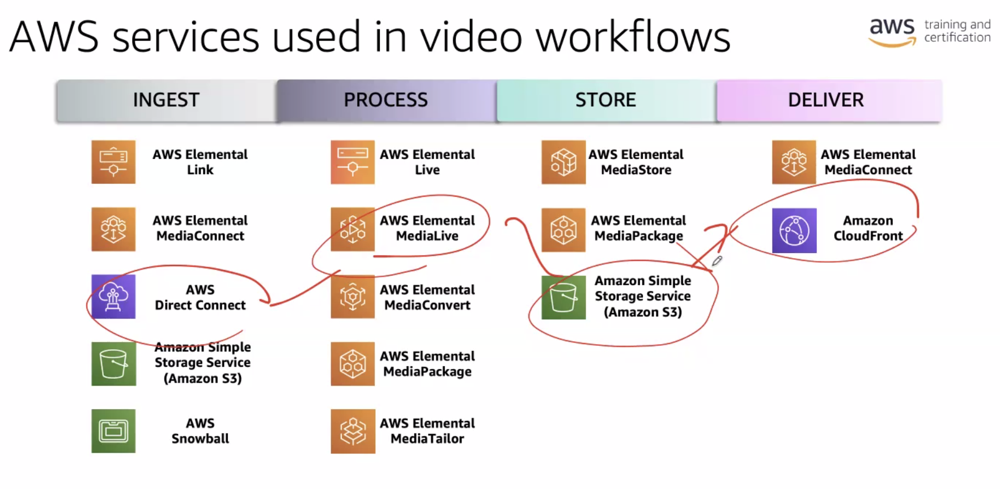

- not for learning concepts and basics of AWS
	- for this look at [aws skill builder course](https://explore.skillbuilder.aws/learn/course/external/view/elearning/134/aws-cloud-practitioner-essentials?lacp=tile&tile=dt)
- for practice labs [click here](https://us-east-1.student.classrooms.aws.training/class/cHR1L5UmHU1zk5ZsWMZquv)
# Video Streaming Terminologies
- bitrate, resolution: image quality
- frame rate, latency: video quality
- video compression
	- can be done by removing information insignificant to the eye
	- some color information can be removed
	- brightness information should not be removed because eyes are sensitive to it
	- similarly eyes are sensitive to color gradients
- codecs: algorithms to compress and transcode media
- Group of Pictures encoding and types of GOP frames:
	- I(Intra) frame is the first frame in a GOP, doesn't depend on previous or future slides for decoding, it's encoding is internal - so Intra frame
	- P(Predictor) frame is dependent on previous frames for decoding
	- B(Bidirectional Predictor) frame is dependent on previous and future frames for decoding
- ABR(Adaptive Bitrate) allows viewers to choose quality levels based on bandwidth
# Anatomy of Video Streaming
- phases:
	1. ingest
	2. process
		- compression and transcoding
		- packaging
		- encryption
		- monetization
	3. store
		- live stream caching: mediaPackage and one other tool
		- video-on-demand storage: S3(simple storage service)
	4. deliver
		- Content Delivery Network(CDN): Origin and Edge servers. can use Amazon CloudFront
		- transport data within and out of cloud

## Variables that affect design decisions
- Level of expertise
- Budget
- Video Quality
- Latency
- Reliability
- Rights Management
# AWS services in VOD workflows
- AWS lab tutorials
- list of AWS services:
	- MediaConvert for processing
	- S3 for frequent access and S3 Glacier for long term archiving
	- Step Functions
	- Lambda schedules actions
	- SQS(Simple Queueing Service) used for Queueing tasks?
	- DynamoDB records activity, serverless and very fast
	- API Gateway for creating APIs
	- ML services: Rekognition, Transcribe, Comprehend, Translate, Polly